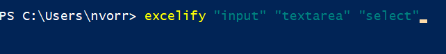

# Excelify

## Excelify is a command line tool for automatically mapping html element attributes to an excel spreadsheet.

While working I was faced with doing this task by hand, so I
decided to make this tool.

You can specify specific html elements like so :

## How to use

1) Clone this repository and run npm install

2) Open the command line or shell in the same directory as the html document you want to parse or CD into it.

3) Go ahead and run the excelify command followed by the elements you want to target. You can target them the same way you would using a jQuery selector. You can target multiple elements by using quotes.

4) You will then be promped for the name of the html file you want to parse, the name of your new excel spreadsheet, and few other options regarding the html attributes you want to output.

5) The excel spreadsheet will be outputted in your current directory with your specified html attributes. Cheers!